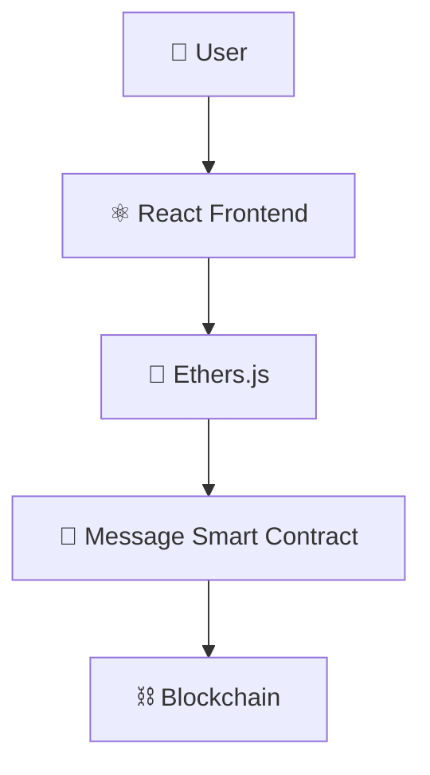

<div align="center">

# 💬 Message DApp

**A decentralized messaging application using the blockchain as an immutable storage layer**


</div>

---

## 📑 Table of Contents

- [Overview](#-overview)
- [Features](#-features)
- [Tech Stack](#-tech-stack)
- [Architecture](#-architecture)
- [Smart Contract Functions](#-smart-contract-functions)
- [Getting Started](#-getting-started)
- [Learning Outcomes](#-learning-outcomes)
- [Future Improvements](#-future-improvements)
- [Author](#-author)

---

## 📖 Overview

**Message DApp** is a decentralized messaging application that allows users to store messages directly on the blockchain. The project demonstrates how blockchain can serve as a **decentralized storage layer** for immutable data.

Users can submit messages and retrieve them directly from the smart contract — no centralized database required.

---

## ✨ Features

| Feature | Description |
|---|---|
| 📝 Store Messages On-Chain | Write messages directly to contract storage |
| 📥 Retrieve Messages | Read the latest stored message |
| 🔗 Smart Contract Integration | Frontend interacts directly with the contract |
| 👛 Wallet Connectivity | Connect via MetaMask or any injected wallet |
| 🔒 Immutable Data Storage | Messages cannot be altered once written |

---

## 🛠 Tech Stack

| Layer | Technologies |
|---|---|
| **Frontend** | React, JavaScript, Ethers.js |
| **Blockchain** | Solidity, Hardhat, Ethereum |

---

## 🏗 Architecture



---

## 📜 Smart Contract Functions

| Function | Type | Description |
|---|---|---|
| `setMessage()` | Write | Stores a new message on-chain |
| `getMessage()` | Read | Returns the currently stored message |

```solidity
function setMessage(string memory _message) public {
    message = _message;
}

function getMessage() public view returns (string memory) {
    return message;
}
```

---

## 🚀 Getting Started

### Prerequisites
- Node.js (v16+)
- MetaMask browser extension
- Hardhat

### Installation

```bash
# Clone the repository
git clone https://github.com/Jeevan9898/message-dapp.git
cd message-dapp

# Install dependencies
npm install

# Compile the smart contract
npx hardhat compile

# Start a local blockchain
npx hardhat node

# Deploy the contract
npx hardhat run scripts/deploy.js --network localhost

# Start the frontend
cd frontend
npm install
npm start
```

---

## 🎓 Learning Outcomes

- String Storage On Blockchain
- Smart Contract State Variables
- Blockchain Transactions
- React + Solidity Interaction

---

## 🔮 Future Improvements

- [ ] Multiple Messages
- [ ] Message History
- [ ] User Profiles
- [ ] IPFS Integration

---

## 👤 Author

**Jeevan Yadav**

[](https://jeevan-yadav.vercel.app/)
[](https://github.com/Jeevan9898)
